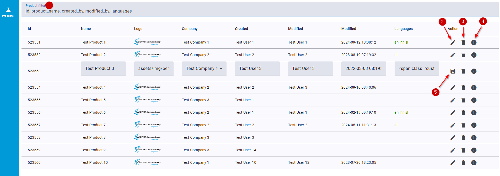

# **Chemical App**

This Angular project implements a simple **Chemical App** using Angular Material components and NgRx SignalStore. The application provides the following functionalities:

- **View Products**: Products are listed in a table. The `Id` field is considered useful fot the user.
- **Filter Products**: Users can filter products based on several columns.
- **View Details**: Users can view detailed information of a product in a modal.
- **Edit Product**: Users can edit product data directly in the table.
- **Delete Product**: Users can remove a product from the list.

**Note**: There is no backend provided. All data is stored in memory.

### **Features Snapshot**

1. **Product Filter** - Filter products based on columns displayed in placeholder
2. **Edit Product Data** - Modify product data inline.
3. **Delete Product** - Remove product from the list.
4. **Product Details** - View full product detail information in a modal.
5. **Save Product Data** - Save modified data.

## Prerequisites

Before setting up the project, ensure the following software is installed on the machine:

- **Node.js** (version 22.11.0 or later) - [Download Node.js](https://nodejs.org/)
- **Angular CLI** (version 18.2.0 or later) - Install via `npm install -g @angular/cli`

## Getting Started

Follow these steps to get the project running locally:

##### 1. Clone repo
` git clone https://github.com/StructuredCode/chemical-app.git `

##### 2. Navigate to project directory and install required dependencies with
` cd chemical-app `
` npm install `

##### 3. Run the application
` ng serve `

##### 4. Open your web browser and navigate to http://localhost:4200/

## Running unit tests

Run `ng test` to execute the unit tests via [Karma](https://karma-runner.github.io).

## Further help

To get more help on the Angular CLI use `ng help` or go check out the [Angular CLI Overview and Command Reference](https://angular.dev/tools/cli) page.

## Running unit tests

Run `ng test` to execute the unit tests via [Karma](https://karma-runner.github.io).

## Further help

To get more help on the Angular CLI use `ng help` or go check out the [Angular CLI Overview and Command Reference](https://angular.dev/tools/cli) page.
